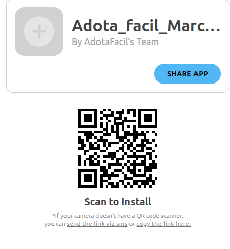

# GRUPO_03_ADOCAO_PETS

# AdotaFacil
### Descrição do Projeto

O App de Adoção de Pets é um protótipo de aplicativo móvel desenvolvido como parte da disciplina Engenharia de Software Aplicada. O objetivo do protótipo é conectar protetores, ONGs e abrigos a pessoas interessadas em adotar animais de forma segura, prática e organizada. Ele permite validar fluxos, funcionalidades e experiência do usuário antes do desenvolvimento da aplicação final.

### Grupo de Trabalho

Ana Clara Mendes

Iasmim de Melo

John Wesley da Silva

Lucas Henrique da Silva menezes

Marcos Vinicius Satro

Mateus Neres da Silva

###  Funcionalidades Principais do Protótipo

- Cadastro e login de usuários (adotantes e protetores/ONGs).

- Navegação pelos pets disponíveis com filtros por tipo, idade, porte, raça e comportamento.

- Visualização detalhada do perfil do pet, incluindo fotos e informações essenciais.

- Solicitação de adoção e acompanhamento do status da solicitação.

- Comunicação direta com o abrigo via chat.

- Gerenciamento de pets para protetores/ONGs (cadastro, edição e exclusão).

## Protótipo no Figma

O protótipo foi desenvolvido no Figma para simular a experiência completa do usuário, incluindo todos os fluxos de adoção, comunicação e gerenciamento de pets.

🔗 Link para o protótipo no Figma: https://www.figma.com/design/CauMEnmB0FmW8Mzxmsg8Qh/AdotaFacil--Copy-?node-id=0-1&t=bdFfwWAV8dv6YKtw-1

### Público-Alvo

Adotantes interessados em adotar pets de forma segura e prática.

Protetores, ONGs e abrigos que desejam disponibilizar pets para adoção.

Comunidade local, incluindo moradores de Rio Tinto-PB e cidades próximas.

#### Como Utilizar o Protótipo

Acesse o link do Figma.

Navegue pelas telas simulando o fluxo de cadastro, login, busca por pets e solicitação de adoção.

Teste interações, visualização de detalhes do pet e comunicação com o abrigo.

Link para o Backlog: https://docs.google.com/document/d/1HDntjcPTwgAinjZChciEZUD7EzPiYMX0EX-AEeOv9Mg/edit?tab=t.0#heading=h.xk87ffz9g1zq

Aqui está o backlog formatado em Markdown para você colocar direto no **README**:

# Backlog – Adota Fácil

## Autenticação
- **Cadastro de usuário**: Permite que o usuário crie uma conta com email, senha, nome e username.  
- **Login**: Usuário acessa o app com email e senha.  
- **Logout**: Usuário pode sair da conta com segurança.  
- **Recuperar senha**: Envia link ou opção para redefinição de senha.  

## Perfil
- **Visualizar perfil**: Exibe informações do usuário (nome, email, seguidores, pets cadastrados).  
- **Editar perfil**: Permite atualizar nome, email, username, foto e localização.  
- **Excluir conta**: Remove permanentemente os dados do usuário.  
- **Ver seguidores/seguindo**: Mostra quem o usuário segue e quem o segue.  

## Pets
- **Cadastrar pet**: Usuário cuidador registra um pet (nome, idade, raça, foto e descrição).  
- **Listar pets**: Mostra todos os pets disponíveis para adoção.  
- **Filtrar pets**: Permite aplicar filtros (categoria, idade, raça etc.).  
- **Ver detalhes do pet**: Exibe informações completas de um pet específico.  

## Adoção
- **Solicitar adoção**: Usuário envia uma solicitação ao cuidador para adotar um pet.  
- **Confirmar envio de solicitação**: Exibe mensagem de sucesso confirmando o envio da solicitação.  

## Favoritos
- **Adicionar aos favoritos**: Usuário pode salvar pets de interesse para acessar depois.  
- **Listar favoritos**: Mostra todos os pets salvos como favoritos.  
- **Remover dos favoritos**: Permite excluir um pet da lista de favoritos.  

## Conversas
- **Iniciar chat**: Usuário pode começar uma conversa com outro usuário/cuidador.  
- **Enviar mensagens**: Permite troca de mensagens em tempo real.  
- **Visualizar histórico**: Exibe todas as mensagens trocadas anteriormente.  

## Extras
- **Notificações push**: Envia alertas sobre mensagens e solicitações de adoção.  
- **Avaliações**: Permite avaliar cuidadores/adotantes após adoção.  
- **Geolocalização**: Mostra pets disponíveis próximos à localização do usuário.  

### Protótipo no Adalo

O protótipo foi desenvolvido no Adalo para demonstrar as funcionalidades com um banco de dados funcional

QR Code: 
